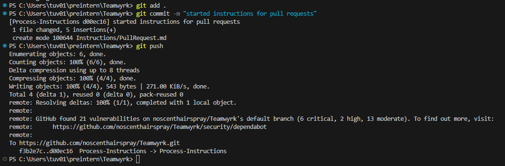
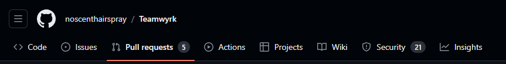
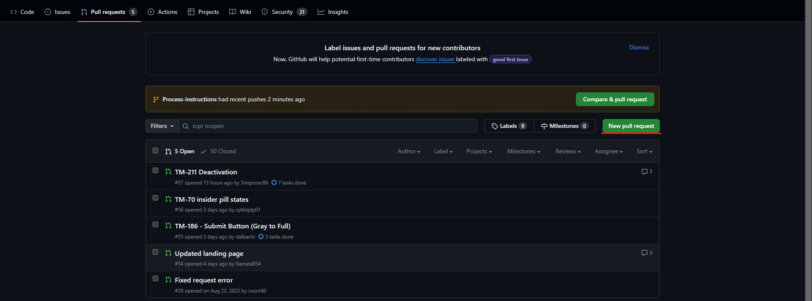
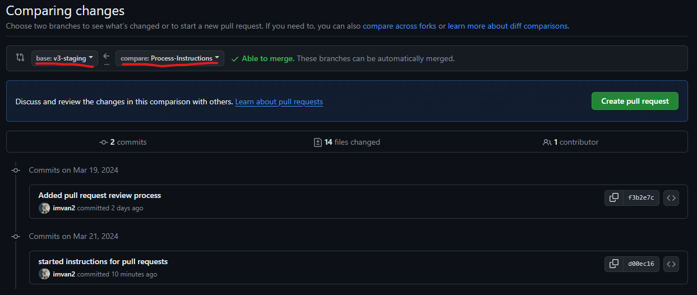
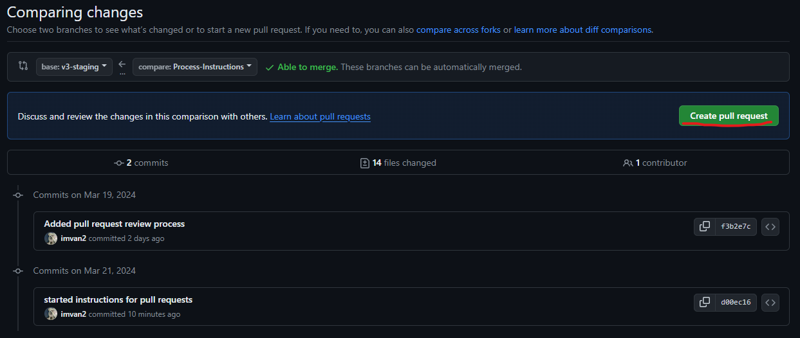
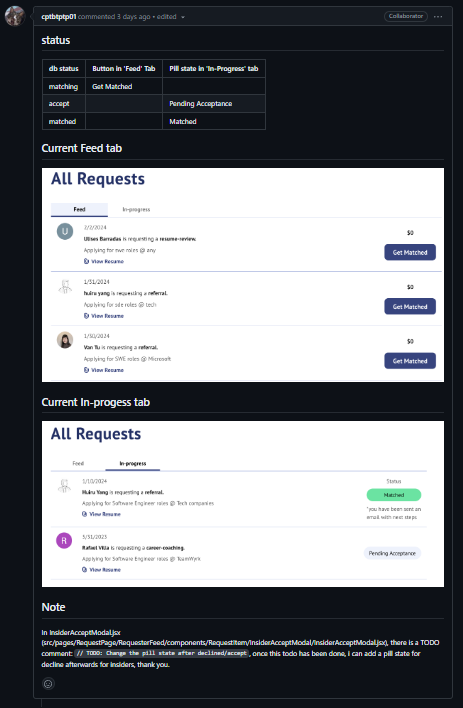
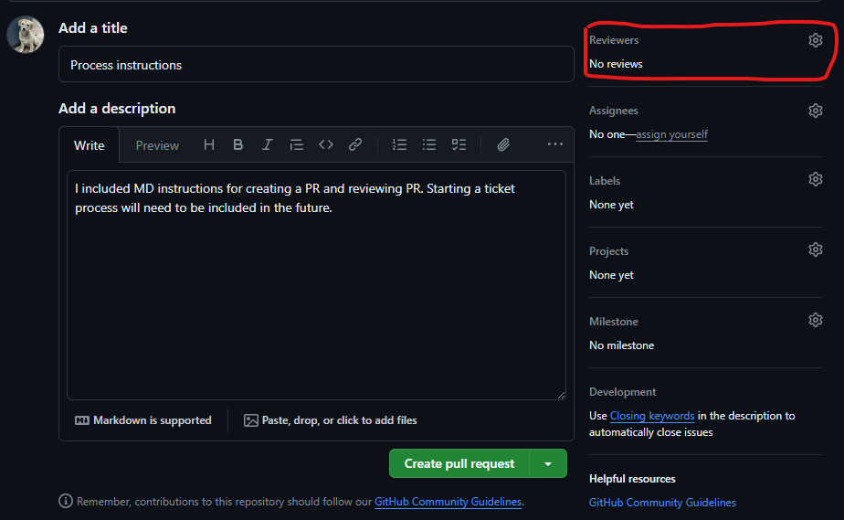
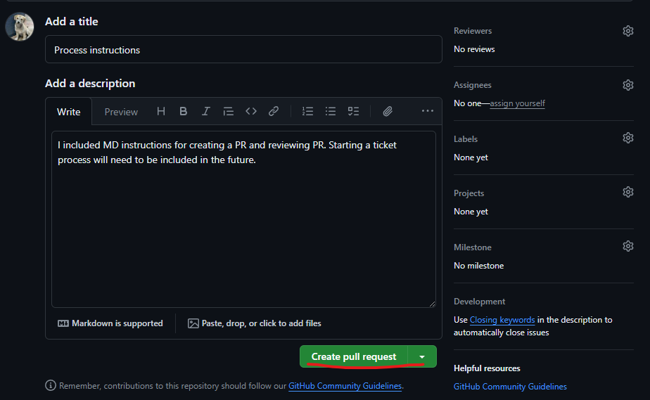
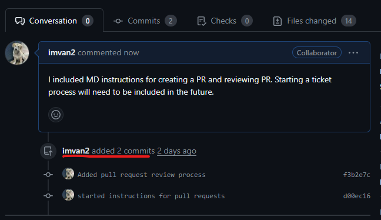

# Guidelines for creating pull requests on Github

**These are just general guildelines. They need not be strictly followed.**

1.  Once you're done with your ticket, you will need to make a pull request that allows other devs to check your work and merge your branch into the production branch.

2.  Before creating a pull request, make sure you've pushed your local branch to Github.

    

3.  Go on Teamwyrk's Github and click on the pull request tab

    

4.  Click on 'New Pull Request'

    

5.  You will then change the base branch and the compare branch. The base branch is the production branch you want to merge into. The compare branch is your ticket's branch.

     1. It should say that you are able to merge. If not, then there are some merge conflicts that need to be fixed before merging.

            You can fix these merge conflicts on Github or on your editor, depending on which is easier for you.

            Some of the conflicts can be:
            - incorrect base branch clicked in the pull request
            - base branch is not the production branch you copied from
            - your ticket's branch does not have updated code when it was copied from the production branch

6.  Click on 'Create pull Request' if you are able to merge

    

7.  In the 'Add a title', add your ticket number from Jira and a short description of the ticket. An example is 'TM-82 Email Notification: Account Deactivated & Deleted'. In the screenshot below, there was no ticket involved.

    

8.  Add the description of your ticket. You can be as detailed as you want. A good example is the below:

    

9.  You can add reviewers to look at your request. You can always add reviewers after submitting.

    

10. Once everything is added, click on 'Create pull request'

    

11. Now you're done! Wait for devs to review your request. Any future commits you add to your ticket branch will be automatically updated in the pull request. You do not need to create a pull request everytime you commit.

    
